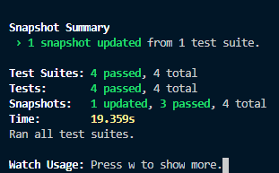

> This is the repository for the Geektrust Finding Falcone Frontend challenge.

## Steps to setup and run : 

- Install dependencies : `npm install`
- Run the app : `npm run start`
- Build : `npm run build`
- Test : `npm run test`

## Directory structure
```
build/
public/
src/
    components/
        Header
        Footer
        Main
        Planets
        Selectors
        Vehicles
    utils/
        config/
            api.js
        services/
            apiCalls.js
        stateUpdaterMethods.js
    App.js
    index.css
    index.js
```

## Tests passing

